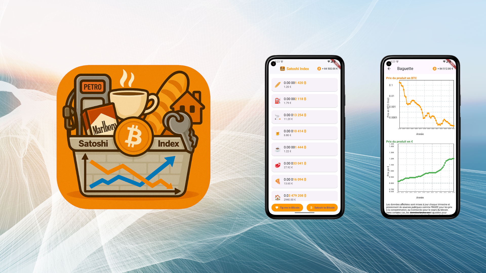
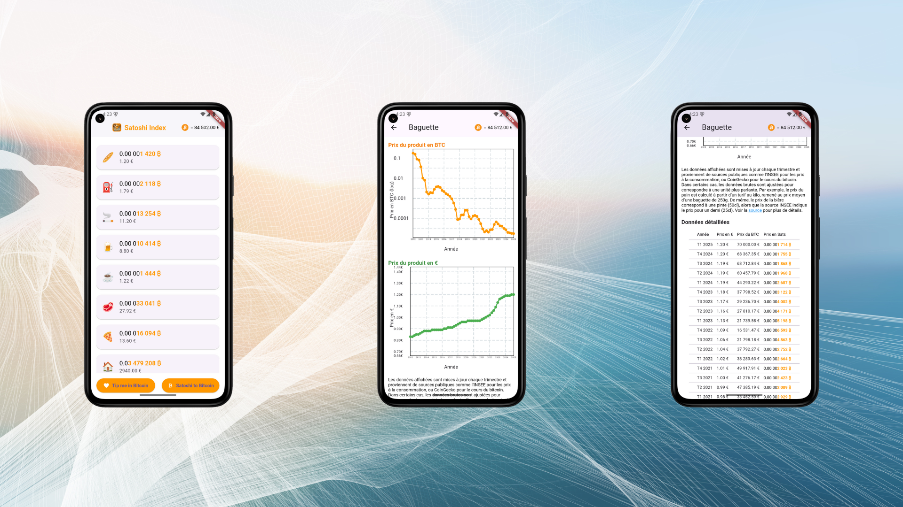

# 🧮 Satoshi Index

**Satoshi Index** est une application mobile Flutter qui permet de suivre l’évolution des prix des produits du quotidien en euros (€) et en bitcoins (₿), exprimés en **satoshis**. C’est une nouvelle manière de comprendre l’inflation et le pouvoir d’achat à travers le prisme du Bitcoin.

---

 

## 📲 Fonctionnalités principales

- 🟠 **Prix du Bitcoin** mis à jour toutes les 2 minutes (API CoinGecko)
- 📈 **Graphiques interactifs** affichant l’évolution des prix en € et en ₿
- 📊 **Tableau des données historiques** avec les prix détaillés par trimestre
- 📚 **Explication du satoshi** (l’unité minimale du bitcoin)
- 🤝 **Page de donation** en bitcoin via QR code
- 🔗 **Sources officielles INSEE** pour les prix des produits
- ✅ **APK prêt à l’emploi** dans les releases GitHub

---

## 🛍️ Produits suivis

Voici la liste complète des produits actuellement disponibles dans l’application :

| Produit         | Emoji | Donnée INSEE                                             | Ajustement                |
|----------------|-------|-----------------------------------------------------------|---------------------------|
| 🥖 Baguette     | 🥖    | Prix au kilo de pain                                      | Moyenne de 250g           |
| ⛽ Essence SP95 | ⛽    | Prix au litre (donnée directe)                            | Aucun                     |
| ☕ Café         | ☕    | Prix au kilo                                              | Environ 7g par tasse      |
| 🍺 Bière        | 🍺    | Prix d’un demi (25cl)                                     | Multiplié par 2 (pinte)   |
| 🚬 Cigarette    | 🚬    | Prix du paquet de 20 cigarettes                           | Aucun                     |
| 🥩 Côte de bœuf | 🥩    | Prix au kilo de côte de bœuf                              | Aucun                     |
| 🏠 Immobilier   | 🏠    | Indice des prix immobiliers (référence 2015 = 100)        | Base de 2300 €/m² en 2015 |

---

## 🧭 Comment utiliser l'application

1. **Page d’accueil :** Affiche les produits avec leur prix en satoshis (BTC) et en euros.
2. **Page produit :**
   - Deux graphiques :
     - Évolution du prix du produit en BTC (logarithmique)
     - Évolution du prix en euros (linéaire)
   - Tableau complet avec prix du produit, prix du BTC, prix en satoshis pour chaque trimestre.
   - Source cliquable vers les données officielles.
3. **Page "Satoshi to Bitcoin" :**
   - Tableau pédagogique expliquant la correspondance entre les satoshis et les bitcoins.
4. **Page "Tip me in Bitcoin" :**
   - QR code et adresse pour envoyer un soutien en BTC.

---

## 📸 Aperçu visuel

  
 
  

---

## 📦 Fichier APK disponible

Un **fichier APK prêt à l’emploi** est disponible dans la section **[Releases](https://github.com/OxScuba/Satoshi_Index/tree/main/apk)** du dépôt. Il vous suffit de le télécharger et de l’installer sur n’importe quel appareil Android.

---

## ⚙️ Installation depuis le code source

### Prérequis

- [Flutter](https://docs.flutter.dev/get-started/install) 3.x
- Android Studio ou Visual Studio Code
- Un appareil ou émulateur Android

### Étapes

```bash
git clone https://github.com/OxScuba/Satoshi_Index.git
cd satoshi-index
flutter pub get
flutter run

```
---

## 🔐 Sources et licences

- **INSEE** : [insee.fr/statistiques](https://www.insee.fr/fr/statistiques)
- **CoinGecko API** : [coingecko.com](https://www.coingecko.com/)
- **Whitepaper Bitcoin** : [bitcoin.org/bitcoin.pdf](https://bitcoin.org/bitcoin.pdf)

---

## 👨‍💻 Contribuer

Les contributions sont les bienvenues !  
Voici quelques pistes pour participer :

- ✅ Ajout de nouveaux produits  
- 🌍 Intégration de sources internationales  
- 🎨 Optimisation graphique ou technique  
- 📱 Widgets Android natifs *(en cours de développement)*

---

## 📄 Licence

Ce projet est sous **licence MIT**.  
Vous êtes libres de le modifier, le distribuer et le réutiliser dans vos projets.

---

## 🧡 Soutien

Vous aimez ce projet ? Vous pouvez soutenir son développement avec un don en **Bitcoin** :

**Scuba_Wizard@getalby.com**  
