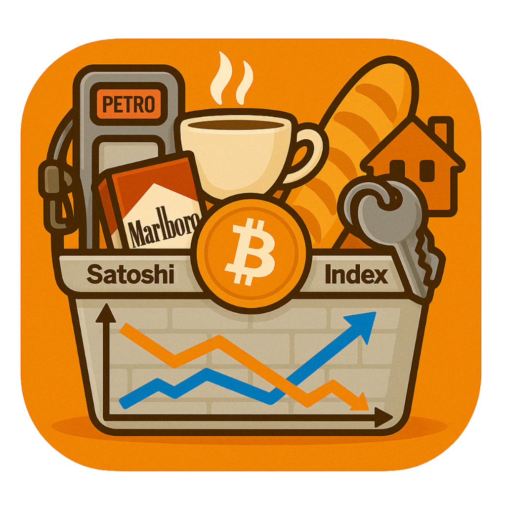
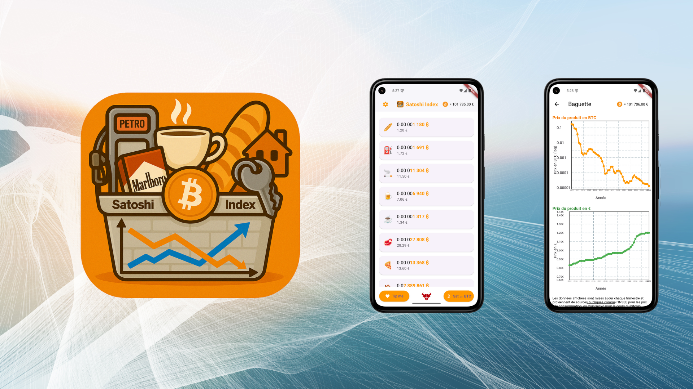
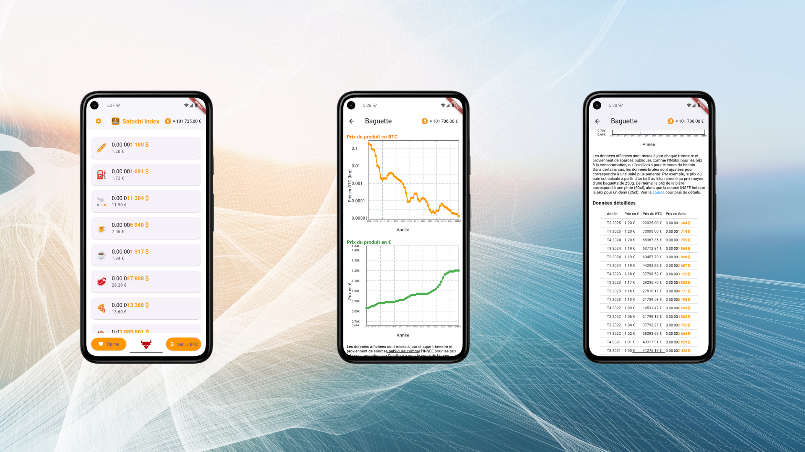
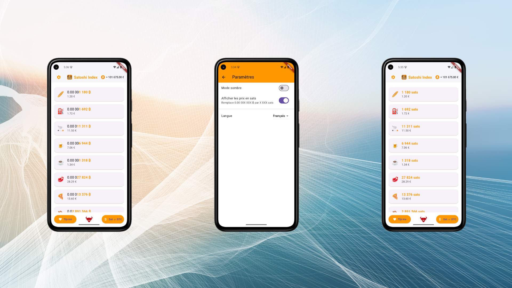
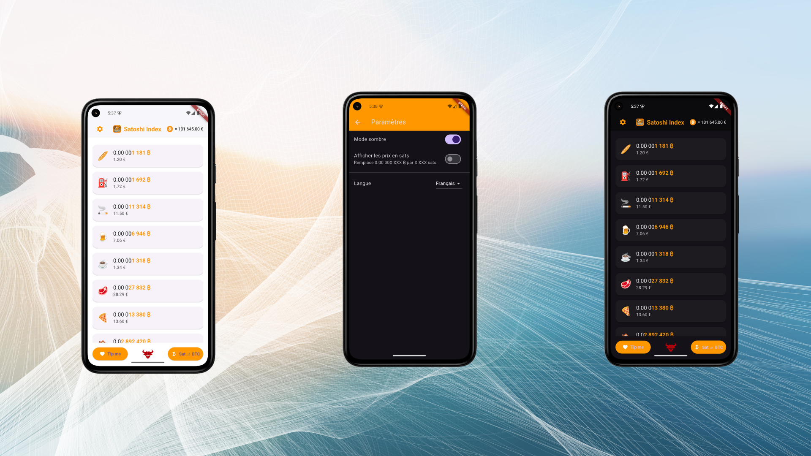

<div align="center">



# Satoshi Index

### Les prix du quotidien vus à travers Bitcoin

[](LICENSE.md)
[](https://flutter.dev)
[](https://github.com/OxScuba/Satoshi_Index/releases/latest)
[](https://github.com/OxScuba/Satoshi_Index/releases/latest)
[](#produits-et-données)

**Satoshi Index** est une application libre qui compare l’évolution du prix de produits du quotidien en monnaie fiat, en bitcoins et en satoshis.

Elle permet de visualiser l’inflation autrement : non seulement en regardant combien coûte un café, une baguette ou un mètre carré en euros, mais aussi combien de satoshis sont nécessaires pour les acheter au fil du temps.

[📱 Télécharger l’APK](https://github.com/OxScuba/Satoshi_Index/releases/latest)
·
[🌐 Ouvrir la version web](https://oxscuba.github.io/Satoshi_Index/)
·
[🐛 Signaler un problème](https://github.com/OxScuba/Satoshi_Index/issues)

</div>

---

<p align="center">
  
</p>

## Pourquoi Satoshi Index ?

Les statistiques traditionnelles montrent généralement l’évolution des prix dans une monnaie dont la valeur évolue elle-même.

Satoshi Index ajoute une autre unité de mesure : **Bitcoin**.

L’application permet notamment de répondre à ces questions :

- Combien de satoshis fallait-il pour acheter une baguette il y a plusieurs années ?
- Comment le prix d’un café évolue-t-il en euros et en Bitcoin ?
- Quelle quantité de biens peut-on acheter avec un montant donné en BTC ?
- Le prix que je paie réellement est-il différent du prix statistique de référence ?
- Combien de satoshis vaut un produit qui compte dans mon propre quotidien ?
- Comment les produits apparaissent-ils dans ma propre devise ?

> **1 bitcoin = 100 000 000 satoshis**

---

## Fonctionnalités

### Prix et pouvoir d’achat

- Affichage des produits en **BTC** ou directement en **satoshis**.
- Prix fiat convertis dans la devise choisie.
- Mise en évidence orange des chiffres significatifs du prix en Bitcoin.
- Actualisation régulière des cours de Bitcoin et d’Ethereum via CoinGecko.
- Cache local permettant de conserver le dernier cours disponible en cas de coupure réseau.

### Historique trimestriel

Chaque fiche produit contient :

- l’évolution du prix en euros ;
- l’évolution du prix en Bitcoin et en satoshis ;
- des graphiques linéaires et logarithmiques ;
- un tableau détaillé trimestre par trimestre ;
- le prix historique du Bitcoin utilisé pour chaque calcul ;
- la source de la série lorsqu’elle est disponible.

Les données historiques restent affichées dans leur monnaie de référence afin de ne pas réécrire le passé selon la devise sélectionnée aujourd’hui.

### Prix personnalisés

L’utilisateur peut remplacer le dernier prix statistique d’un produit par le prix qu’il paie réellement :

- son café dans son établissement habituel ;
- sa baguette chez son boulanger ;
- sa bière, sa pizza ou son plein d’essence ;
- le prix de l’or proposé par son négociant.

Le prix personnel est utilisé sur :

- la page d’accueil ;
- la page Outils ;
- les widgets Android.

Les graphiques et tableaux historiques conservent toujours les données trimestrielles officielles.

Les prix personnalisés sont enregistrés **localement en euros** et ne quittent pas l’appareil.


### Produits personnels

En plus des produits historiques intégrés à l’application, l’utilisateur peut créer jusqu’à **trois produits personnels** correspondant à ses propres habitudes.

Chaque produit personnel comprend :

- un nom ;
- un emoji ;
- un prix actuel ;
- une devise d’origine parmi les douze devises disponibles.

Quelques exemples :

- 🥐 un croissant ;
- 🍜 un bol de nouilles ;
- 🚇 un ticket de métro ;
- 🥙 un kebab ;
- 🎟️ une place de cinéma.

Les produits personnels apparaissent :

- en bas de la page d’accueil ;
- dans les comparaisons de la page Outils ;
- dans la liste des produits disponibles pour les widgets Android.

Leur prix est automatiquement converti en BTC, en satoshis et dans la devise d’affichage sélectionnée. La devise d’origine reste conservée afin d’éviter qu’un produit saisi en HKD, en USD ou en RUB soit artificiellement figé en euros.

Contrairement aux produits officiels, les produits personnels ne possèdent ni fiche historique, ni graphique, ni série trimestrielle. Ils représentent uniquement un prix actuel choisi par l’utilisateur.

Les produits personnels sont enregistrés localement et peuvent être modifiés ou supprimés à tout moment.

### Douze devises

Satoshi Index prend en charge :

| Code | Devise | Symbole |
|:---:|---|:---:|
| EUR | Euro | € |
| USD | Dollar américain | $ |
| GBP | Livre sterling | £ |
| CHF | Franc suisse | CHF |
| CAD | Dollar canadien | CA$ |
| AUD | Dollar australien | A$ |
| JPY | Yen japonais | ¥ |
| CNY | Yuan chinois | CN¥ |
| HKD | Dollar de Hong Kong | HK$ |
| SGD | Dollar de Singapour | S$ |
| RUB | Rouble russe | ₽ |
| ILS | Nouveau shekel israélien | ₪ |

Le cours de Bitcoin, les cartes de l’accueil, les prix personnalisés, les produits personnels, Ethereum, le convertisseur et les widgets utilisent automatiquement la devise sélectionnée.

### Convertisseur universel

La page **Outils** permet une conversion instantanée entre :

1. satoshis ;
2. bitcoins ;
3. euros ;
4. devise secondaire choisie.

Lorsque l’euro est sélectionné, la quatrième ligne affiche le dollar américain. Pour toute autre devise, cette ligne devient la devise sélectionnée.

La même page calcule également le pouvoir d’achat correspondant :

```text
100 000 sats
≈ X cafés
≈ X baguettes
≈ X grammes d’or
```

### Widgets Android configurables

Satoshi Index propose des widgets natifs pour l’écran d’accueil Android :

- choix du produit pour chaque instance ;
- plusieurs widgets simultanés ;
- prix en BTC ou en sats ;
- devise synchronisée avec l’application ;
- prise en compte des prix personnalisés ;
- prise en charge des produits personnels ;
- actualisation périodique autonome ;
- actualisation manuelle en touchant le widget ;
- format initial compact `2 × 1` ;
- redimensionnement horizontal ;
- texte et contenu adaptés à la largeur disponible.

Trois apparences sont disponibles :

- **Classique**, avec fond plein ;
- **Transparent**, avec texte blanc ;
- **Transparent**, avec texte noir.

Les chiffres significatifs du prix Bitcoin restent orange dans tous les thèmes.

### Ressources Bitcoin

L’application comprend également :

- une explication pédagogique du satoshi ;
- un tableau de conversion entre BTC et sats ;
- un graphique Bitcoin intégré via TradingView ;
- le white paper de Bitcoin ;
- une page de ressources pour acheter et comprendre Bitcoin ;
- une page de soutien par don en Bitcoin.

---

## Produits et données

Les données sont organisées par trimestre et sont actuellement mises à jour jusqu’au **T2 2026**.

| Produit | Unité affichée | Source ou méthode principale | Prix personnalisable |
|---|---|---|:---:|
| 🥖 Baguette | Une baguette | Série INSEE du pain, ajustée à une baguette | ✅ |
| ⛽ Essence SP95 | Un litre | Série INSEE | ✅ |
| 🚬 Cigarettes | Un paquet | Série INSEE | ✅ |
| 🍺 Bière | 50 cl | Série INSEE, ajustée depuis 25 cl | ✅ |
| ☕ Café | Une tasse | Série INSEE au kilo, ajustée par tasse | ✅ |
| 🥩 Bœuf | Un kilogramme | Série INSEE | ✅ |
| 🍕 Pizza | Une pizza | Série historique du projet | ✅ |
| 🍔 Big Mac | Un Big Mac, zone euro | Big Mac Index de *The Economist* | ✅ |
| 🪙 Or | Un gramme | Série de référence convertie en grammes | ✅ |
| 💩 Ethereum | Un ETH | Historique et cours live CoinGecko | Non, cours live |
| 🏠 Immobilier | Un mètre carré | Indice immobilier et base de référence | Non |

> Les ajustements permettent de ramener les séries statistiques à une unité concrète et compréhensible. Ils sont documentés dans les fichiers du dossier [`lib/data`](lib/data).

À ces onze produits officiels peuvent s’ajouter jusqu’à **trois produits personnels** définis localement par l’utilisateur. Ces produits ne possèdent pas d’historique, mais bénéficient des mêmes conversions actuelles en BTC, sats et devises fiat.

---

## Utilisation

### Installer l’application Android

1. Ouvrir la page [Releases](https://github.com/OxScuba/Satoshi_Index/releases/latest).
2. Télécharger le dernier fichier `.apk`.
3. Autoriser ponctuellement l’installation depuis cette source si Android le demande.
4. Installer puis ouvrir Satoshi Index.

### Ajouter un widget Android

1. Ouvrir Satoshi Index une première fois afin de synchroniser les cours.
2. Effectuer un appui long sur l’écran d’accueil.
3. Ouvrir la section **Widgets**.
4. Sélectionner **Satoshi Index · Produit**.
5. Choisir le produit et l’apparence.
6. Redimensionner horizontalement le widget selon la place disponible.

### Configurer ses prix personnels

1. Ouvrir **Paramètres**.
2. Sélectionner **Prix personnalisés**.
3. Saisir le prix réellement payé.
4. Laisser un champ vide pour revenir au prix trimestriel de référence.
5. Enregistrer.


### Ajouter ses propres produits

1. Ouvrir **Paramètres**.
2. Sélectionner **Mes produits**.
3. Choisir l’un des trois emplacements disponibles.
4. Saisir un nom, un emoji, un prix et sa devise d’origine.
5. Enregistrer.

Le produit apparaît ensuite en bas de l’accueil, dans la page Outils et dans le sélecteur des widgets Android.

Un produit personnel peut être renommé, repricé ou supprimé à tout moment. Lorsqu’un produit utilisé par un widget est supprimé, le widget demande simplement d’en sélectionner un autre.

### Changer de devise

1. Ouvrir **Paramètres**.
2. Sélectionner **Devise d’affichage**.
3. Rechercher ou choisir une devise.
4. Revenir à l’accueil.

Le changement est appliqué à l’accueil, aux outils et aux widgets. Les historiques restent en euros.

---

## Aperçu

<p align="center">
  
  
  
</p>

<p align="center">
  
  
</p>

> Certaines captures peuvent présenter une version antérieure de l’interface.

---

## Installation depuis le code source

### Prérequis

- Flutter stable avec une version de Dart compatible avec `^3.7.0` ;
- Android Studio, Visual Studio Code ou un autre environnement Flutter ;
- un appareil Android ou un émulateur pour tester l’APK.

### Cloner et lancer

```bash
git clone https://github.com/OxScuba/Satoshi_Index.git
cd Satoshi_Index

flutter pub get
flutter run
```

### Vérifier et compiler

```bash
dart format lib test
flutter analyze
flutter test
flutter build apk --release
```

L’APK généré se trouve normalement ici :

```text
build/app/outputs/flutter-apk/app-release.apk
```

### Construire la version web

```bash
flutter build web --release --base-href "/Satoshi_Index/"
```

Le contenu à publier se trouve dans :

```text
build/web
```

---

## Architecture simplifiée

```text
lib/
├── data/          Séries historiques trimestrielles
├── models/        Produits officiels et personnels, devises et cours
├── pages/         Écrans de l’application
├── services/      CoinGecko, cache, personnalisation et widgets
└── assets/        Images, logos et documents

android/app/src/main/kotlin/
└── .../widgets/   Widgets Android natifs et rafraîchissement autonome
```

Les données historiques sont séparées de la logique d’affichage. Les prix personnalisés, les trois produits personnels et les préférences sont stockés localement avec `SharedPreferences`.

---

## Sources principales

- [INSEE](https://www.insee.fr/fr/statistiques) pour plusieurs séries de prix françaises ;
- [CoinGecko](https://www.coingecko.com/) pour les cours de Bitcoin et d’Ethereum ;
- [Big Mac Index](https://www.economist.com/big-mac-index) de *The Economist* ;
- [Bitcoin.org](https://bitcoin.org/bitcoin.pdf) pour le white paper de Bitcoin ;
- [TradingView](https://www.tradingview.com/) pour le graphique de marché intégré.

Les données et services externes restent soumis à leurs propres conditions d’utilisation et peuvent connaître des retards ou des interruptions.

---

## Confidentialité

Satoshi Index est conçu sans compte utilisateur et sans collecte de données personnelles.

- Aucun compte n’est requis.
- Les prix personnalisés restent sur l’appareil.
- Les produits personnels restent sur l’appareil.
- Les préférences et le cache sont stockés localement.
- L’application n’accède ni aux contacts, ni au microphone, ni à la caméra.
- L’accès à Internet sert à récupérer les cours de marché et à ouvrir certaines ressources externes.
- Les widgets utilisent un snapshot local de l’application et actualisent les cours de marché nécessaires.

---

## Limites et avertissement

Satoshi Index est un outil pédagogique et informatif.

- Les prix historiques peuvent reposer sur des moyennes, indices ou ajustements.
- Les prix personnalisés dépendent des valeurs saisies par l’utilisateur.
- Les produits personnels ne possèdent pas de données historiques ni de source statistique.
- Les conversions fiat utilisent des taux croisés calculés à partir des cours de Bitcoin.
- Les cours en direct dépendent de services externes.
- L’application ne constitue ni un conseil financier, ni une recommandation d’investissement.

---

## Contribuer

Les contributions sont les bienvenues.

Quelques pistes :

- ajouter de nouveaux produits ;
- améliorer ou documenter les séries historiques ;
- intégrer d’autres pays et sources internationales ;
- ajouter de nouvelles devises ;
- améliorer l’accessibilité et les traductions ;
- optimiser les widgets Android ;
- préparer ou améliorer la distribution F-Droid.

Workflow conseillé :

```bash
git checkout -b feature/ma-fonctionnalite
git commit -m "feat: description de la fonctionnalité"
git push origin feature/ma-fonctionnalite
```

Ouvrez ensuite une Pull Request ou une [issue](https://github.com/OxScuba/Satoshi_Index/issues).

---

## Feuille de route

- Publication sur F-Droid ;
- internationalisation plus complète ;
- nouvelles séries de prix ;
- sources internationales ;
- amélioration continue des widgets ;
- davantage d’options de personnalisation et de sauvegarde locale.

---

## Licence

Ce projet est distribué sous licence [MIT](LICENSE.md).

Vous pouvez l’utiliser, le modifier et le redistribuer conformément aux conditions de cette licence.

---

## Soutenir le projet

Un don en Bitcoin peut être envoyé à :

```text
Scuba_Wizard@getalby.com
```

<p align="center">
  
</p>

<div align="center">

**Mesurer le monde en satoshis change parfois la forme du monde.**

</div>
